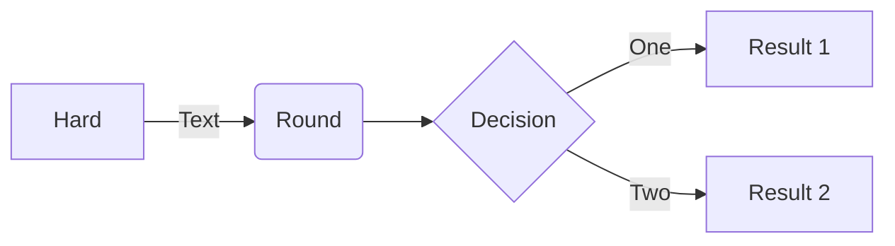

# projetoBancoJava
Projeto de Banco realizado pelo Renew your career: Java

*DIAGRAMA DE CLASSE*


*DIAGRAMA DE SEQUÊNCIA*

- Cadastrar Conta


- Depósito Bancário


- Retirada (Saque)


- Alterar Limite


- Exportar Histórico


## Diagrama com MermaidJS direto no README



## Exemplo processamento highlighting de código

```java
public static void main(String[] args){
  System.out.print("Hello World");
}
```
